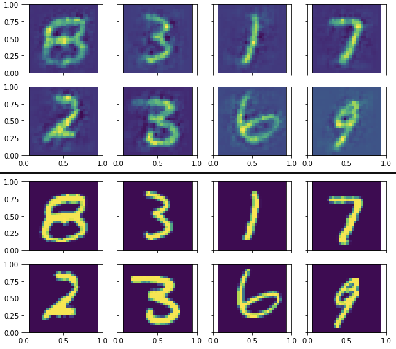

**MNIST Unsupervised Clustering Project**

The goal of this project was to create a machine learning algorithm that can accurately cluster like images from the MNIST dataset. 

My algorithm uses the following steps:
1. Feature learning and extraction with a convolutional autoencoder
2. Dimensionality reduction using the tSNE algorithm
3. Clustering on the reduced dimensions with simple kmeans 

Using the data given in class, the algorithm acheived about 96% accuracy in clustering

Here, we can see the autoencoder's reconstructed images compared to the original

Here, we can see the clusters of the validation set after tSNE

Visually, its clear that the algorithm creates strong clusters. Each colors corresponds to a different ground truth. 
